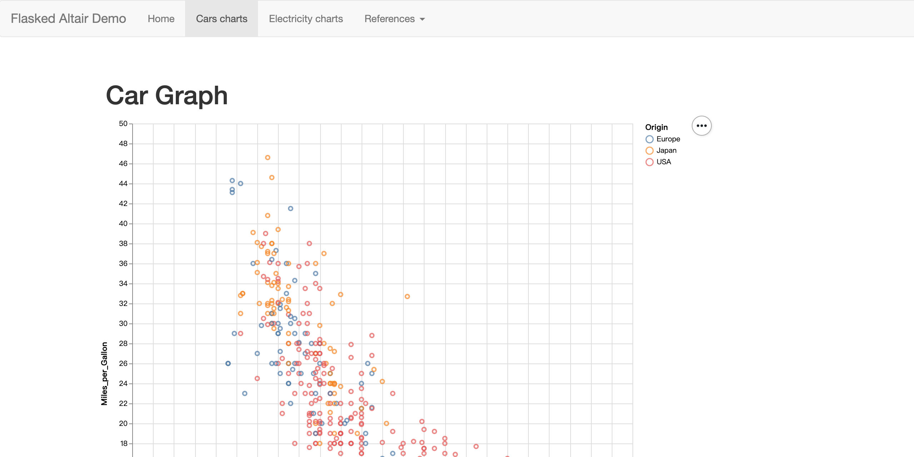

# Flasked-Altair

Demo [Flask](http://flask.pocoo.org) application of using [Altair](https://altair-viz.github.io/index.html) to generate [D3](https://d3js.org) charts using [Vega](https://vega.github.io/vega/) grammar. Using the awesome Flask framework and the Altair library makes it ridiculously easy to create D3 visualization without writing any client side code. Besides, the mouse over effect is powered by [Vega-tooltip](https://github.com/vega/vega-tooltip).



Inspired by the [Flasked-Vincent](https://github.com/iiSeymour/flasked-vincent) project.

## Requirements

- Python3
- [Pipenv](https://github.com/pypa/pipenv)

## Running

```
$ git clone https://github.com/leoluyi/flasked-altair
$ cd flasked-altair
$ pipenv install
$ ./run.sh
```

Visit http://localhost:5000 in your browser, that's it!
